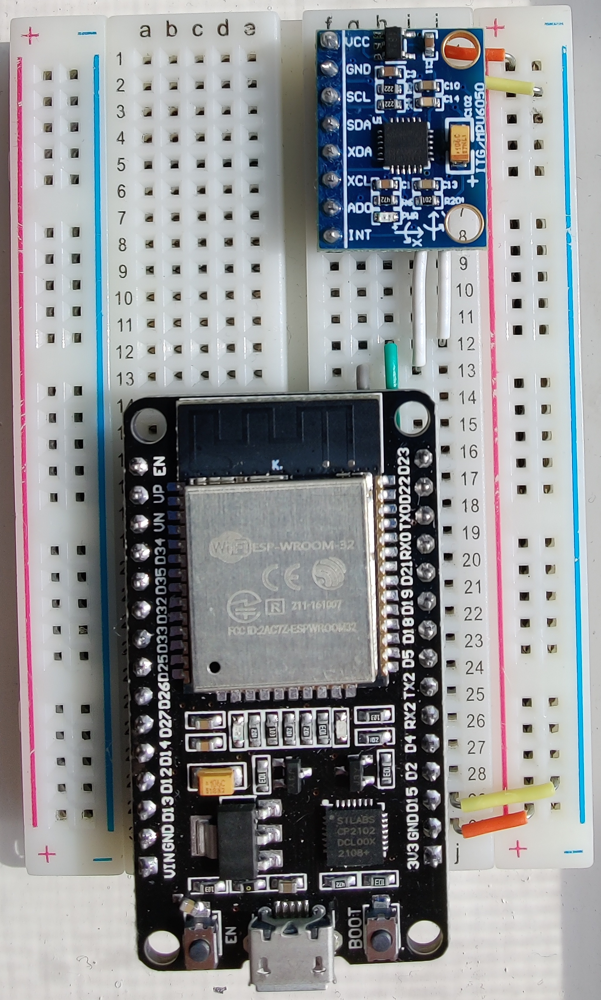
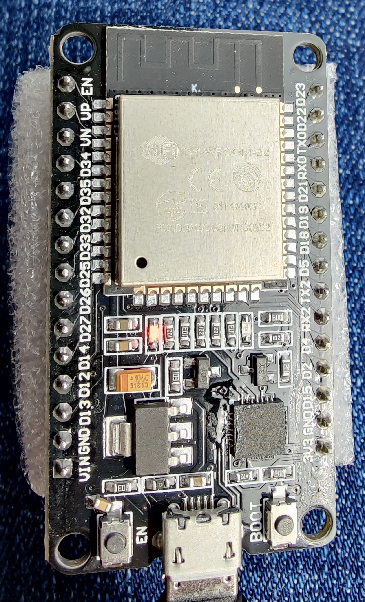

# LaundrySensorSite
Gavin Epperson's Fall 2021 Honors Capstone project. A simple locally-hosted proof of concept website to allow users to view the status of washers and dryers.

## Repo Structure
Although this project began as a simple Angular application with a NodeJS server, it was scaled back to a simple microcontroller-based local website.  
The unfinished original site can be found under the *back-end* (Node server) and *front-end* (Angular) directories.  
The final microcontroller used can be found in the *Microcontroller-Code* directory, with the Receiver and Sender microcontroller code further separated. 

## Microcontroller Code
The microcontrollers used in this project are ESP devices from Espressif, and they communicate using ESP-NOW with a many-to-one structure.
This means that there are multiple **Sender** microcontrollers, but only one **Receiver** microcontroller. 
The code for these microcontrollers can be found in each microcontroller's *src/main.cpp* file.

### Sender Microcontrollers
These microcontrollers are attached to the washers/dryers and send accelerometer sensor data to the Receiver microcontroller using ESP-NOW.  
Both the ESP8266 and ESP32 microcontrollers are supported as senders here and have their distinct codes located in the *Microcontroller-Code* directory.  

*The ESP32 Sender and the MPU6050 accelerometer.*

### Receiver Microcontroller
This microcontroller receives sensor data from each Sender and updates the monitoring website it hosts locally as it receives new data. 
It does so by changing the HTML directly using JavaScript asynchronous event handlers.  
Only the ESP32 microcontroller is supported as a receiver here.

*The ESP32 Receiver.*
